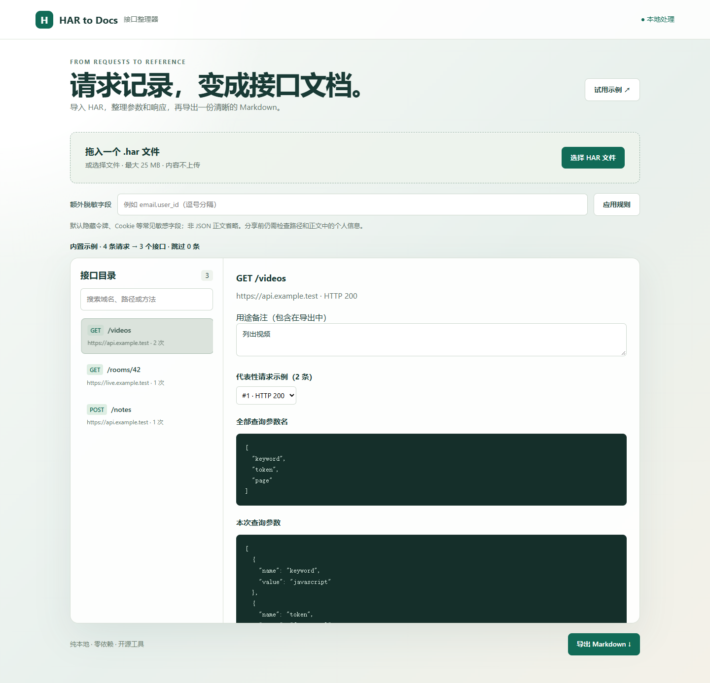

# HAR to Docs

[](https://github.com/AK1116q/har-to-docs/actions/workflows/ci.yml)

**Turn browser network captures into readable, redacted API documentation.**

HAR to Docs is a local-first HAR explorer and Markdown API reference generator. It has no account system, no backend, and no runtime dependencies.



## Why It Exists

Browser DevTools are great for debugging, but Network panels become noisy fast. This tool groups requests by origin, HTTP method, and path, then keeps useful request and response examples so you can export a clean Markdown reference.

It only organizes the HAR file you import. It does not crawl websites, call private APIs, or validate whether an endpoint is official or stable.

## Getting Started

Requires Node.js 22 or newer. No `npm install` step is needed.

```bash
npm start
```

Open the local URL printed by the terminal, usually `http://127.0.0.1:4173`. Click **Try sample / 试用示例**, or drop in a `.har` file.

If the default port is busy, run this in PowerShell:

```powershell
$env:PORT = '42831'
npm start
```

The app is served through a local HTTP server. Opening the HTML file directly through `file://` is not supported.

## Exporting a HAR File

Open your browser DevTools, record the workflow you want to document in the Network tab, then export the capture as HAR. Browser menus vary, but Chrome and Edge both support saving Network activity as a HAR file.

Export only the requests you need. After importing, review the redaction result before sharing the generated Markdown. If the HAR does not include response bodies, this tool will show that clearly in the output.

## Features

- Groups by origin, HTTP method, and path.
- Tracks request count, HTTP statuses, and query parameter names.
- Keeps up to five representative examples per endpoint and prefers distinct HTTP statuses.
- Shows headers, query parameters, request bodies, JSON responses, and Bash/zsh cURL examples.
- Lets you add notes for each endpoint; notes are included in Markdown export.
- Redacts common tokens, passwords, cookies, authorization values, signatures, and custom field names.
- Handles files up to 25 MB and captures with up to 20,000 requests.

## CLI

```bash
node bin/cli.mjs dist/sample.har
node bin/cli.mjs dist/sample.har -o api.md
node bin/cli.mjs dist/sample.har --redact email,user_id -o redacted-api.md
```

When `-o` is used, the command refuses to overwrite an existing file. Without `-o`, it writes Markdown to stdout. Extra redaction fields are matched by name, case-insensitively; path expressions are not supported.

## Redaction Boundaries

Query parameters, structured request bodies, and JSON responses are recursively redacted by field name. URL usernames, passwords, and fragments are removed. Request headers only keep non-sensitive values for `Accept`, `Content-Type`, and `Accept-Language`; other header values are hidden. Plain text bodies, Base64 responses, and file contents are omitted.

Field-name redaction is not full privacy detection. IDs in paths, personal information in natural-language text, unknown fields, and JSON embedded inside strings may remain. Review exports before sharing them.

## Current Limits

- The output is documentation from observed traffic, not an official API contract.
- It does not infer required fields, auth scopes, or JSON Schema.
- It does not turn `/users/1` and `/users/2` into a route template.
- cURL examples are redacted and usually cannot authenticate as-is.
- Multipart uploads, missing response bodies, and platform signatures cannot be replayed from the generated examples.
- Non-HTTP(S) requests are skipped.
- WebSocket frames, Protobuf, gRPC, and Base64 bodies are not parsed.
- Very large JSON numbers follow JavaScript precision rules; use strings for large integer IDs in source data.

## Development

```bash
npm test
```

The browser app and CLI share `dist/core.mjs`. Tests cover grouping, redaction, malformed HAR members, representative examples, prototype keys, Markdown fences, and cURL quoting.

`dist/` is hand-written static source and can be hosted as a static site. This repository does not publish a hosted production site.

See [validation notes](docs/VALIDATION.md) and [contributing notes](CONTRIBUTING.md).

## Roadmap

- Export an OpenAPI draft with clear sample-derived warnings.
- Add a manual review checklist before exporting OpenAPI.
- Compare two HAR captures and summarize endpoint changes.

## License

[MIT](LICENSE)
